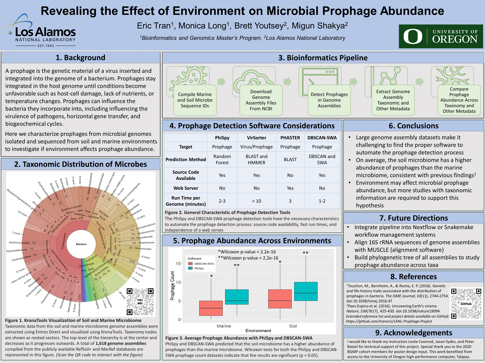

### BGMP LANL Prophage Project
By Eric Tran, Monica Long, Brett Youtsey, and Migun Shakya

This project was completed as a collaboration between the University of Oregon and Los Alamos National Laboratory.

The goal of the project is to understand how soil and marine environment affects microbial prophage abundance. Soil and marine bacterial genome assemblies were compiled from the RefSoil+ and MarRef reference sequence databases respectively. A high-throughput prophage annotation pipeline was developed to annotate the bacterial genomes. The taxonomic distribution for the assemblies were visualized with KronaTools (https://traneric.github.io/).

This project is still in development. The next steps include a thorough examination of the data to elucidate prophage distribution patterns across taxonomic groups.

FUTURE DIRECTIONS:

- Optimize pipeline with a workflow management system
- Phylogenetic analysis of bacterial genome assemblies
- Statistical analyses of prophage distribution across taxonomic groups

2021 Genomics in Action Poster:

